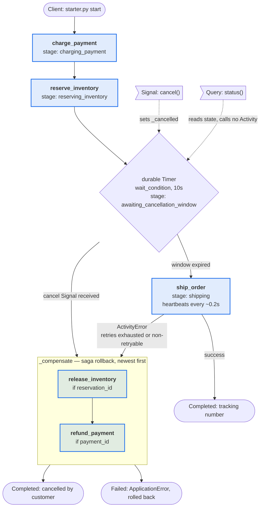
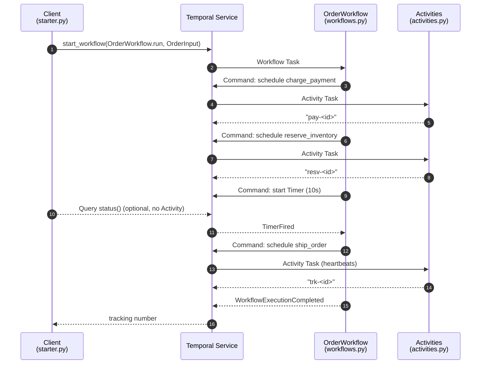

# Workflow → Activity map

Which Workflow calls which Activity, and for which use case. There is exactly
one Workflow in this repo (`OrderWorkflow` in `workflows.py`), registered on the
`orders` Task Queue by `worker.py`. Every Activity below lives in
`activities.py` and is registered via `ALL_ACTIVITIES`.

## The table

| Use case | Workflow | Activities called, in order | Terminal state |
|---|---|---|---|
| **Happy path** — order goes out the door | `OrderWorkflow.run` | `charge_payment` → `reserve_inventory` → *(durable Timer, 10s)* → `ship_order` | Completed, returns `trk-<order_id>` |
| **Customer cancels** inside the window (`cancel` Signal) | `OrderWorkflow.run` → `_compensate` | `charge_payment` → `reserve_inventory` → `release_inventory` → `refund_payment` | Completed, returns `"order … cancelled by customer"` |
| **Shipping fails** (retries exhausted, or non-retryable `ShippingRejected`) | `OrderWorkflow.run` → `_compensate` | `charge_payment` → `reserve_inventory` → `ship_order` ✗ → `release_inventory` → `refund_payment` | Failed with `ApplicationError` |
| **Transient Activity failure** (`FLAKY_ACTIVITIES=1`) | `OrderWorkflow.run` | same as the case it occurs in; the failing Activity is retried by the Service (5 attempts, 1s initial, ×2 backoff) | unchanged — the Workflow never sees it |
| **Read current stage** (`status` Query) | `OrderWorkflow.status` | *none* — Queries must not call Activities | n/a, returns `OrderStatus` |
| **Request cancellation** (`cancel` Signal) | `OrderWorkflow.cancel` | *none* — sets a flag that `wait_condition` is watching | n/a |

Compensations always run newest-first: `release_inventory` before
`refund_payment`. `_compensate` is guarded — it only releases a reservation if
`reserve_inventory` succeeded, and only refunds if `charge_payment` succeeded.

## Per-Activity reference

| Activity | Called from | Timeouts / policy | Purpose |
|---|---|---|---|
| `charge_payment` | `run`, stage `charging_payment` | `start_to_close=30s`, retry ×5 | Take the money; returns `pay-<order_id>` |
| `reserve_inventory` | `run`, stage `reserving_inventory` | `start_to_close=30s`, retry ×5 | Hold the item; returns `resv-<order_id>` |
| `ship_order` | `run`, stage `shipping` | `start_to_close=60s`, `heartbeat=10s`, retry ×5 | Hand to carrier; long enough to heartbeat, and the designated failure point |
| `release_inventory` | `_compensate` | `start_to_close=30s`, default retry | Undo `reserve_inventory` |
| `refund_payment` | `_compensate` | `start_to_close=30s`, default retry | Undo `charge_payment` |

## The flow

> The two `COMP` exits are mutually exclusive per run: the cancellation branch
> ends Completed, the shipping-failure branch ends Failed.

## Sequence, happy path

